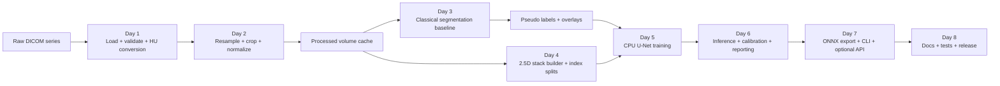
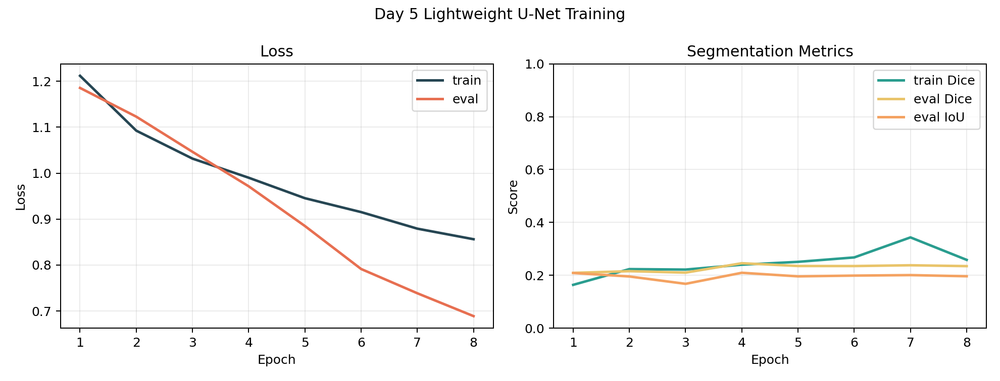

# AI Medical Imaging Playground

Small, end-to-end CT head segmentation project built as an 8-day portfolio sprint: from raw DICOM loading to preprocessing, pseudo-label generation, lightweight 2.5D training, robustness checks, ONNX export, and CPU deployment.

The goal of this repository is not to claim clinical performance. It is to show a hiring-ready engineering story:
- define a constrained imaging problem
- build a reproducible pipeline with clear artifacts
- measure what improved and what still limits confidence
- package the result so another person can run it

## What This Repo Demonstrates

- Robust DICOM ingestion with HU validation and metadata checks
- Reproducible preprocessing and cached volume generation
- A classical baseline used to create pseudo labels when manual labels are unavailable
- A lightweight 2.5D U-Net trained on CPU
- Holdout-aware evaluation, calibration, and uncertainty summaries
- ONNX export plus deterministic CPU inference through a CLI
- Clear documentation, tests, and release-ready repo structure

## Pipeline Architecture



## Results Snapshot

Repository demo state after the limitation-improvement pass:

| Area | Snapshot |
| --- | --- |
| Data split | `17 train / 4 val / 4 test / 4 buffer` slices |
| Day 5 holdout Dice | `0.3302` |
| Day 5 holdout IoU | `0.2626` |
| Calibration ECE | `0.4526 -> 0.1588` after temperature scaling |
| Day 7 ONNX validation | Passed, `max_abs_diff=3.624e-05` |
| Day 7 CLI determinism | Same SHA-256 mask hash across repeated runs |
| Day 7 deployment Dice | `0.3331` vs refreshed Day 3 pseudo labels |

Example artifacts already included in the repo:




## Dataset Notes

- The repository includes one sample CT head DICOM series in `data/dicom_series_01/`.
- No private labels or patient annotations are included.
- Day 3 generates pseudo labels from a classical segmentation baseline; later metrics should be interpreted as pipeline-validation metrics, not clinical accuracy.
- The sample scan uses relatively thick slices, which is one reason the final model uses a 2.5D design instead of full 3D training.

## Quickstart

```powershell
python -m venv .venv
./.venv/Scripts/Activate.ps1
python -m pip install -r requirements.txt
./.venv/Scripts/python.exe -m unittest discover -s tests -v
```

Run the included CPU deployment demo end to end:

```powershell
./.venv/Scripts/python.exe deploy/cli_infer.py `
  --series-dir data/dicom_series_01 `
  --checkpoint saved_models/best.pt `
  --onnx-path onnx/model.onnx `
  --processed-dir data_processed `
  --output-dir outputs/day7_infer_demo `
  --threads 1 `
  --batch-size 1 `
  --mask-format npz `
  --force-export
```

## Repro Checklist

Use this sequence for a clean rerun from the bundled sample data:

1. Install dependencies from `requirements.txt`.
2. Inspect the raw series:

```powershell
./.venv/Scripts/python.exe scripts/inspect_series.py
```

3. Generate the processed cache:

```powershell
./.venv/Scripts/python.exe scripts/preprocess_series.py
```

4. Create pseudo labels and overlays:

```powershell
./.venv/Scripts/python.exe scripts/classical_baseline.py
```

5. Build the Day 4 index and preview the loader:

```powershell
./.venv/Scripts/python.exe scripts/make_index.py
```

6. Train and evaluate the lightweight model:

```powershell
./.venv/Scripts/python.exe scripts/train.py
./.venv/Scripts/python.exe scripts/infer.py
```

7. Generate the Day 6 report package:

```powershell
./.venv/Scripts/python.exe scripts/report.py
./.venv/Scripts/python.exe scripts/check.py
```

8. Run deployable CPU inference from raw DICOM:

```powershell
./.venv/Scripts/python.exe deploy/cli_infer.py `
  --series-dir data/dicom_series_01 `
  --checkpoint saved_models/best.pt `
  --onnx-path onnx/model.onnx `
  --processed-dir data_processed `
  --output-dir outputs/day7_infer_demo `
  --threads 1 `
  --batch-size 1 `
  --mask-format npz `
  --force-export
```

9. Optional deployment paths:

```powershell
python -m uvicorn deploy.app:app --host 0.0.0.0 --port 8000
docker build -t ai-medimg-v1 .
docker run --rm -p 8000:8000 ai-medimg-v1
```

## Tests

The test suite covers:
- DICOM loading
- preprocessing
- classical segmentation helpers
- 2.5D dataset construction and deterministic transforms
- segmentation metrics
- a Day 8 end-to-end CLI smoke test

Run all tests:

```powershell
./.venv/Scripts/python.exe -m unittest discover -s tests -v
```

## Deployment Contract

Input contract:
- `deploy/cli_infer.py` expects one axial CT DICOM series folder.
- `saved_models/best.pt` and `onnx/model.onnx` must match the exported model configuration.
- The optional FastAPI `/predict` endpoint expects a ZIP file containing a single DICOM series.

Output contract:
- `prediction_mask.npz` stores `predicted_labels` as a `(Z, Y, X)` `uint8` volume and `spacing_zyx`.
- `prediction_mask.nii.gz` is available with `--mask-format nii.gz`.
- `day7_infer_report.json` stores runtime settings, class voxel counts, uncertainty summary, and ONNX validation info.
- `day7_preprocess_report.json` stores raw-vs-processed shape, spacing, crop box, and preprocessing configuration.
- `overlays/` stores per-slice PNG overlays when `--output-formats overlays` is enabled.

## Design Choices

- **2.5D instead of 3D:** The sample scan has coarse slice spacing and the project is intentionally CPU-friendly. Using `(z-1, z, z+1) -> z` captures some through-plane context without the memory and engineering overhead of full 3D training.
- **Pseudo labels instead of manual labels:** No expert annotations are bundled, so the repo uses a classical baseline to bootstrap supervision and focuses on transparent documentation of that tradeoff.
- **CPU-first deployment:** The main deployment goal is reproducibility and portability. ONNX Runtime on CPU is easier to demo reliably than a GPU-specific stack.

More explanation is in [docs/interview_notes.md](docs/interview_notes.md).

## Documentation Map

- [docs/README.md](docs/README.md): documentation index
- [docs/one_page_summary.md](docs/one_page_summary.md): one-page executive overview
- [docs/interview_notes.md](docs/interview_notes.md): design choices, tradeoffs, and failure cases
- [docs/release_notes_v1.0.md](docs/release_notes_v1.0.md): release summary for `v1.0`
- [docs/project_journal.md](docs/project_journal.md): consolidated Day 1 to Day 7 journal plus the limitation-improvement pass
- [docs/model_card.md](docs/model_card.md): model scope and review guidance
- [docs/limitation_improvements.md](docs/limitation_improvements.md): measured mitigation pass

## Known Limitations

- Metrics are reported against Day 3 pseudo labels rather than expert annotations, so they are useful pipeline signals rather than clinical claims.
- The project still uses one bundled CT series, which makes the internal validation more honest than before but does not establish patient-level generalization.
- Thick-slice geometry limits through-plane continuity and is one reason this repo favors a 2.5D approach.
- Artifact-heavy scans may still challenge the classical bootstrap stage and the downstream model.
- The uncertainty outputs are helpful for QA and review prioritization, but they should not be treated as calibrated clinical risk.

## Repository Layout

```text
data/                 sample DICOM input
data_processed/       processed volume, pseudo labels, index, predictions
deploy/               ONNX runtime, CLI, optional FastAPI entrypoint
docs/                 portfolio-facing documentation and release notes
outputs/              reference figures and reports
scripts/              stage-by-stage runnable scripts
src/                  reusable pipeline modules
tests/                unit tests and smoke tests
saved_models/         trained PyTorch checkpoint
onnx/                 exported ONNX artifact
```
